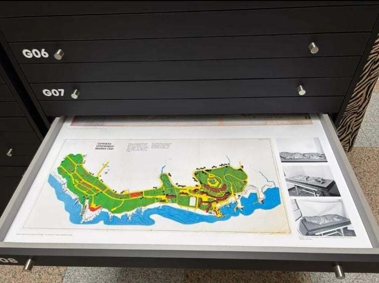
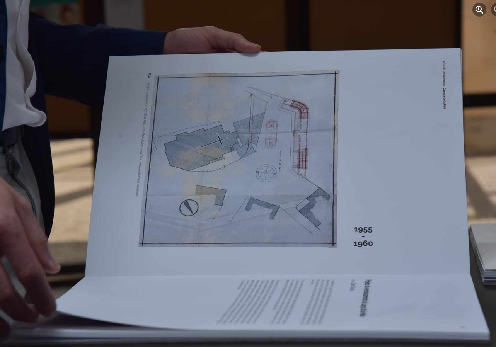
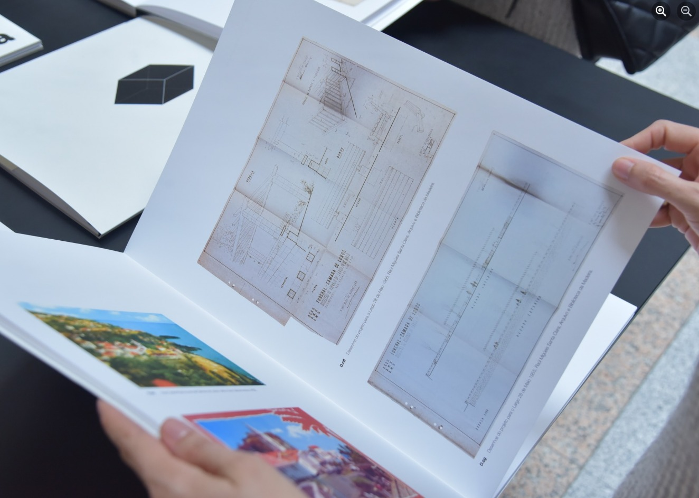
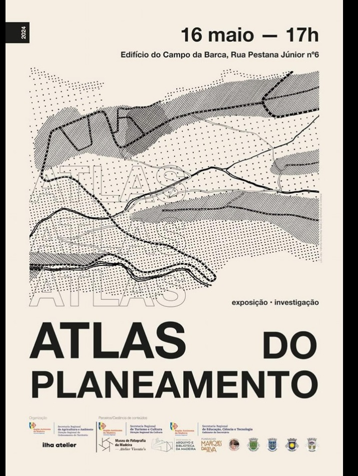

// function openPhotoGallery(event) {
//   const galleryItem = event.currentTarget;
//   const imagePath = galleryItem.querySelector('img').src;

//   // Abre um novo separador com a imagem
//   const newTab = window.open(imagePath, '_blank', 'width=800,height=600');
// }

// function openPhotoDetails(imagePath, title, relatedPhotos = [], year, author, text, description) {
//   const newWindow = window.open('', '_blank', 'width=1900,height=900');
//   const relatedPhotosHTML = relatedPhotos.map(relatedPhoto => ``).join('');

//   // Split the description into paragraphs based on sentence endings
//   const paragraphs = description.split(/[!.?]+/).filter(p => p.trim() !== '');

//   const descriptionHTML = paragraphs.map(paragraph => `
${paragraph.trim()}.
`).join('');

//   newWindow.document.write(`
//     <html>
//     <head>
//       <title>${title}</title>
//       

  

//       
//     </head>
//     <body>
//       

//         

//           <h2>${title}</h2>
//           
Ano: ${year}

//           
Autor do Plano: ${author}

//           
Texto Por: ${text}

//           ${descriptionHTML}
//         

//         

//           

//             
//             ${relatedPhotosHTML}
//           

//         

//       

//     </body>
//     </html>
//   `);
// }

// // Restante do código...

// function openImageInNewTab(imageUrl) {
//   const newTab = window.open('', '_blank', 'width=800,height=600');

//   newTab.document.write(`
//     <html>
//     <head>
//       <title>Imagem</title>
//       
//       
//     </head>
//     <body>
//       
//     </body>
//     </html>
//   `);
// }

// document.querySelectorAll('.gallery__item img').forEach((imgElement) => {
//   imgElement.addEventListener('click', () => {
//     const imageUrl = imgElement.src;
//     openImageInNewTab(imagePath);
//   });
// });

// document.addEventListener('DOMContentLoaded', function() {
//   // Seu código aqui
// });

  
  
  
  
  
  
  
  
  
  
  

// function openPhotoGallery(event) {
//     const galleryItem = event.currentTarget;
//     const imagePath = galleryItem.querySelector('img').src;
  
//     // Abre um novo separador com a imagem
//     const newTab = window.open(imagePath, '_blank', 'width=800,height=600');
//   }
  
//   function openPhotoDetails(imagePath, title, relatedPhotos = [], year, author, text, description) {
//     const newWindow = window.open('', '_blank', 'width=1900,height=900');
//     const relatedPhotosHTML = relatedPhotos.map(relatedPhoto => ``).join('');
  
//     // Split the description into paragraphs based on sentence endings
//     const paragraphs = description.split(/[!.?]+/).filter(p => p.trim() !== '');
  
//     const descriptionHTML = paragraphs.map(paragraph => `
${paragraph.trim()}.
`).join('');
  
//     newWindow.document.write(`
//       <html>
//       <head>
//         <title>${title}</title>
//         </head>
//         
  
    
//   
  
  
  
//         
//       </head>
//       <body>
//         

//           

//             <h2>${title}</h2>
//             
Ano: ${year}

//             
Autor do Plano: ${author}

//             
Texto Por: ${text}

//             ${descriptionHTML}
//           

//           

//             

//               
//               ${relatedPhotosHTML}
//             

//           

//         

//       </body>
//       </html>
//     `);
//   }
  
  
  
  

/* codigo para a galeria de fotos css

.photo-gallery {
    display: flex;
    flex-wrap: wrap;
  }
  
  .column {
    flex: 1;
    min-width: 300px;
  }
  
  .column img {
    width: 100%;
    margin-bottom: 10px;
  }
  
  @media (max-width: 600px) {
    .column {
      flex-basis: 100%;
    }
  }
   */

//galeria de fotos html

     <section class="photo-gallery">

            

               
              
            

          
            

              
               
              
            

          
            

              
              
              
              
            

          
          </section> 
          

document.addEventListener('DOMContentLoaded', function() {
    // Exemplo de manipulação do menu dropdown
    const menuItems = document.querySelectorAll('.menu-dropdown a');
    menuItems.forEach(item => {
        item.addEventListener('click', function(event) {
            event.preventDefault();
            // Aqui você pode adicionar a lógica para mostrar a página correspondente
            console.log('Clicou no item:', this.textContent);
        });
    });

//Menu Hamburguer Dropdown 

  // Menu Dropdown 

  document.addEventListener('DOMContentLoaded', function() {
    const menuHamburger = document.querySelector('.menu-hamburger');
    const menuDropdown = document.querySelector('.menu-dropdown');

    menuHamburger.addEventListener('click', function() {
        menuDropdown.style.display = menuDropdown.style.display === 'block' ? 'none' : 'block';
    });
});

//Lidar com a abertura e fecho do Menu

function openNav() {
    document.getElementById("mySidenav").style.width = "250px";
    document.getElementById("main").style.marginLeft = "250px";
}

function closeNav() {
    document.getElementById("mySidenav").style.width = "0";
    document.getElementById("main").style.marginLeft= "0";
}

    // Exemplo de criação de uma estrutura básica para as páginas de fotos
    const photosPage = document.createElement('div');
    photosPage.innerHTML = `
        <h1>Fotos</h1>
        

            
            
Descrição da foto 1

        

        

            
            
Descrição da foto 2

        

    `;
    document.body.appendChild(photosPage);
});

// Banco de dados simulado
const fotos = [
    { ano: 1800, concelho: 'Funchal', freguesia: 'São Pedro', descricao: 'Foto do século 19' },
    { ano: 1900, concelho: 'Calheta', freguesia: 'São Jorge', descricao: 'Foto do século 20' },
    // Adicione mais fotos conforme necessário
];

// Função para exibir fotos na página
function exibirFotos(fotos) {
    const containerFotos = document.createElement('div');
    fotos.forEach(foto => {
        const fotoContainer = document.createElement('div');
        fotoContainer.innerHTML = `
            
            
${foto.descricao}

        `;
        containerFotos.appendChild(fotoContainer);
    
    });
    document.body.appendChild(containerFotos);
}

// Manipulação do menu dropdown para navegar entre as páginas
document.addEventListener('DOMContentLoaded', function() {
    const menuItems = document.querySelectorAll('.menu-dropdown a');
    menuItems.forEach(item => {
        item.addEventListener('click', function(event) {
            event.preventDefault();
            // Aqui você pode adicionar a lógica para mostrar a página correspondente
            console.log('Clicou no item:', this.textContent);
            if (this.textContent === 'Galeria') {
                exibirFotos(fotos);
            }
        });
    });
});

document.addEventListener('DOMContentLoaded', function() {
    // Verifica o hash da URL e exibe a página correspondente
    const hash = window.location.hash.substring(1); // Remove o '#' do início
    if (hash) {
        const menuItem = document.querySelector(`.menu-dropdown a[href="#${hash}"]`);
        if (menuItem) {
            menuItem.click(); // Simula um clique no item do menu
        }
    }

    // Adiciona um evento de clique aos links do menu para atualizar o hash da URL
    const menuItems = document.querySelectorAll('.menu-dropdown a');
    menuItems.forEach(item => {
        item.addEventListener('click', function(event) {
            event.preventDefault();
            window.location.hash = this.getAttribute('href').substring(1); // Remove o '#' do início
        });
    });
});

// Função para gerar páginas dinâmicas
function gerarPagina(categoria) {
    const containerPagina = document.createElement('div');
    containerPagina.innerHTML = `
        <h1>${categoria}</h1>
        

            <!-- As fotos serão inseridas aqui -->
        

    `;
    document.body.appendChild(containerPagina);

    // Exemplo de como inserir fotos no container
    const fotosContainer = containerPagina.querySelector('.fotos-container');
    fotos.forEach(foto => {
        if (foto[categoria.toLowerCase()] !== undefined) {
            const fotoDiv = document.createElement('div');
            fotoDiv.innerHTML = `
                
                
${foto.descricao}

            `;
            fotosContainer.appendChild(fotoDiv);
        }
    });
}

// Manipulação do menu dropdown para navegar entre as páginas
document.addEventListener('DOMContentLoaded', function() {

    document.addEventListener('DOMContentLoaded', function() {
        const menuItems = document.querySelectorAll('.menu-dropdown a');
        menuItems.forEach(item => {
            item.addEventListener('click', function(event) {
                event.preventDefault();
                const categoria = this.textContent.toLowerCase();
                gerarPagina(categoria);
            });
        });
    })
});
    

  
    Exemplo de um site
    

document.addEventListener('DOMContentLoaded', function() {
    // Exemplo de manipulação do menu dropdown
    const menuItems = document.querySelectorAll('.menu-dropdown a');
    menuItems.forEach(item => {
        item.addEventListener('click', function(event) {
            event.preventDefault();
            // Aqui você pode adicionar a lógica para mostrar a página correspondente
            console.log('Clicou no item:', this.textContent);
        });
    });

//Menu Hamburguer Dropdown 

  // Menu Dropdown 

  document.addEventListener('DOMContentLoaded', function() {
    const menuHamburger = document.querySelector('.menu-hamburger');
    const menuDropdown = document.querySelector('.menu-dropdown');

    menuHamburger.addEventListener('click', function() {
        menuDropdown.style.display = menuDropdown.style.display === 'block' ? 'none' : 'block';
    });
});

//Lidar com a abertura e fecho do Menu

function openNav() {
    document.getElementById("mySidenav").style.width = "250px";
    document.getElementById("main").style.marginLeft = "250px";
}

function closeNav() {
    document.getElementById("mySidenav").style.width = "0";
    document.getElementById("main").style.marginLeft= "0";
}

    // Exemplo de criação de uma estrutura básica para as páginas de fotos
    const photosPage = document.createElement('div');
    photosPage.innerHTML = `
        <h1>Fotos</h1>
        

            
            
Descrição da foto 1

        

        

            
            
Descrição da foto 2

        

    `;
    document.body.appendChild(photosPage);
});

// Banco de dados simulado
const fotos = [
    { ano: 1800, concelho: 'Funchal', freguesia: 'São Pedro', descricao: 'Foto do século 19' },
    { ano: 1900, concelho: 'Calheta', freguesia: 'São Jorge', descricao: 'Foto do século 20' },
    // Adicione mais fotos conforme necessário
];

// Função para exibir fotos na página
function exibirFotos(fotos) {
    const containerFotos = document.createElement('div');
    fotos.forEach(foto => {
        const fotoContainer = document.createElement('div');
        fotoContainer.innerHTML = `
            
            
${foto.descricao}

        `;
        containerFotos.appendChild(fotoContainer);
    
    });
    document.body.appendChild(containerFotos);
}

// Manipulação do menu dropdown para navegar entre as páginas
document.addEventListener('DOMContentLoaded', function() {
    const menuItems = document.querySelectorAll('.menu-dropdown a');
    menuItems.forEach(item => {
        item.addEventListener('click', function(event) {
            event.preventDefault();
            // Aqui você pode adicionar a lógica para mostrar a página correspondente
            console.log('Clicou no item:', this.textContent);
            if (this.textContent === 'Galeria') {
                exibirFotos(fotos);
            }
        });
    });
});

document.addEventListener('DOMContentLoaded', function() {
    // Verifica o hash da URL e exibe a página correspondente
    const hash = window.location.hash.substring(1); // Remove o '#' do início
    if (hash) {
        const menuItem = document.querySelector(`.menu-dropdown a[href="#${hash}"]`);
        if (menuItem) {
            menuItem.click(); // Simula um clique no item do menu
        }
    }

    // Adiciona um evento de clique aos links do menu para atualizar o hash da URL
    const menuItems = document.querySelectorAll('.menu-dropdown a');
    menuItems.forEach(item => {
        item.addEventListener('click', function(event) {
            event.preventDefault();
            window.location.hash = this.getAttribute('href').substring(1); // Remove o '#' do início
        });
    });
});

// Função para gerar páginas dinâmicas
function gerarPagina(categoria) {
    const containerPagina = document.createElement('div');
    containerPagina.innerHTML = `
        <h1>${categoria}</h1>
        

            <!-- As fotos serão inseridas aqui -->
        

    `;
    document.body.appendChild(containerPagina);

    // Exemplo de como inserir fotos no container
    const fotosContainer = containerPagina.querySelector('.fotos-container');
    fotos.forEach(foto => {
        if (foto[categoria.toLowerCase()] !== undefined) {
            const fotoDiv = document.createElement('div');
            fotoDiv.innerHTML = `
                
                
${foto.descricao}

            `;
            fotosContainer.appendChild(fotoDiv);
        }
    });
}

// Manipulação do menu dropdown para navegar entre as páginas
document.addEventListener('DOMContentLoaded', function() {

    document.addEventListener('DOMContentLoaded', function() {
        const menuItems = document.querySelectorAll('.menu-dropdown a');
        menuItems.forEach(item => {
            item.addEventListener('click', function(event) {
                event.preventDefault();
                const categoria = this.textContent.toLowerCase();
                gerarPagina(categoria);
            });
        });
    })
});
    

  
    

document.addEventListener('DOMContentLoaded', function() {
    // Exemplo de manipulação do menu dropdown
    const menuItems = document.querySelectorAll('.menu-dropdown a');
    menuItems.forEach(item => {
        item.addEventListener('click', function(event) {
            event.preventDefault();
            // Aqui você pode adicionar a lógica para mostrar a página correspondente
            console.log('Clicou no item:', this.textContent);
        });
    });

//Menu Hamburguer Dropdown 

  // Menu Dropdown 

  document.addEventListener('DOMContentLoaded', function() {
    const menuHamburger = document.querySelector('.menu-hamburger');
    const menuDropdown = document.querySelector('.menu-dropdown');

    menuHamburger.addEventListener('click', function() {
        menuDropdown.style.display = menuDropdown.style.display === 'block' ? 'none' : 'block';
    });
});

//Lidar com a abertura e fecho do Menu

function openNav() {
    document.getElementById("mySidenav").style.width = "250px";
    document.getElementById("main").style.marginLeft = "250px";
}

function closeNav() {
    document.getElementById("mySidenav").style.width = "0";
    document.getElementById("main").style.marginLeft= "0";
}

    // Exemplo de criação de uma estrutura básica para as páginas de fotos
    const photosPage = document.createElement('div');
    photosPage.innerHTML = `
        <h1>Fotos</h1>
        

            
            
Descrição da foto 1

        

        

            
            
Descrição da foto 2

        

    `;
    document.body.appendChild(photosPage);
});

// Banco de dados simulado
const fotos = [
    { ano: 1800, concelho: 'Funchal', freguesia: 'São Pedro', descricao: 'Foto do século 19' },
    { ano: 1900, concelho: 'Calheta', freguesia: 'São Jorge', descricao: 'Foto do século 20' },
    // Adicione mais fotos conforme necessário
];

// Função para exibir fotos na página
function exibirFotos(fotos) {
    const containerFotos = document.createElement('div');
    fotos.forEach(foto => {
        const fotoContainer = document.createElement('div');
        fotoContainer.innerHTML = `
            
            
${foto.descricao}

        `;
        containerFotos.appendChild(fotoContainer);
    
    });
    document.body.appendChild(containerFotos);
}

// Manipulação do menu dropdown para navegar entre as páginas
document.addEventListener('DOMContentLoaded', function() {
    const menuItems = document.querySelectorAll('.menu-dropdown a');
    menuItems.forEach(item => {
        item.addEventListener('click', function(event) {
            event.preventDefault();
            // Aqui você pode adicionar a lógica para mostrar a página correspondente
            console.log('Clicou no item:', this.textContent);
            if (this.textContent === 'Galeria') {
                exibirFotos(fotos);
            }
        });
    });
});

document.addEventListener('DOMContentLoaded', function() {
    // Verifica o hash da URL e exibe a página correspondente
    const hash = window.location.hash.substring(1); // Remove o '#' do início
    if (hash) {
        const menuItem = document.querySelector(`.menu-dropdown a[href="#${hash}"]`);
        if (menuItem) {
            menuItem.click(); // Simula um clique no item do menu
        }
    }

    // Adiciona um evento de clique aos links do menu para atualizar o hash da URL
    const menuItems = document.querySelectorAll('.menu-dropdown a');
    menuItems.forEach(item => {
        item.addEventListener('click', function(event) {
            event.preventDefault();
            window.location.hash = this.getAttribute('href').substring(1); // Remove o '#' do início
        });
    });
});

// Função para gerar páginas dinâmicas
function gerarPagina(categoria) {
    const containerPagina = document.createElement('div');
    containerPagina.innerHTML = `
        <h1>${categoria}</h1>
        

            <!-- As fotos serão inseridas aqui -->
        

    `;
    document.body.appendChild(containerPagina);

    // Exemplo de como inserir fotos no container
    const fotosContainer = containerPagina.querySelector('.fotos-container');
    fotos.forEach(foto => {
        if (foto[categoria.toLowerCase()] !== undefined) {
            const fotoDiv = document.createElement('div');
            fotoDiv.innerHTML = `
                
                
${foto.descricao}

            `;
            fotosContainer.appendChild(fotoDiv);
        }
    });
}

// Manipulação do menu dropdown para navegar entre as páginas
document.addEventListener('DOMContentLoaded', function() {

    document.addEventListener('DOMContentLoaded', function() {
        const menuItems = document.querySelectorAll('.menu-dropdown a');
        menuItems.forEach(item => {
            item.addEventListener('click', function(event) {
                event.preventDefault();
                const categoria = this.textContent.toLowerCase();
                gerarPagina(categoria);
            });
        });
    })
});
    

  
    define o javascript

css layout
    
    * {
    margin: 0;
    padding: 0;
}

body {
    margin: 0;
    padding: 0;
    background-color: #ddd;
}

img {
    border: 0;
}

.cl {
    clear: both;
}

#main {
    -webkit-column-width: 202px;
    -moz-column-width: 202px;
    o-column-width: 202px;
    -ms-column-width: 202px;
    column-width: 202px;
}

.box {
    padding: 10px 0 0 15px;
}

.pic {
    padding: 10px;
    border: 1px solid #ccc;
    border-radius: 5px;
    width: 180px;
    box-shadow: 0 0 5px #666;
}

.pic img {
    width: 180px;
    height: auto;
    display: block;
}
# masonary container
.masonry-container {
    display: grid;
    grid-template-columns: repeat(3, 1fr);
    column-gap: 15px;
}

.masonry-item {
    display: inline-block;
    width: 100%;
}

masonary container

.masonry-container {
    display: grid;
    grid-template-columns: repeat(3, 1fr);
    column-gap: 15px;
}

.masonry-item {
    display: inline-block;
    width: 100%;
}

masonary container

.grid {
    column-count: 3;
    column-gap: 1em;
}

.grid-item {
    background: #ddd;
    display: inline-block;
    margin: 0 0 1em;
    width: 100%;
}

<!-- 
<!DOCTYPE html>
<html lang="pt">
<head>
    <meta charset="UTF-8">
    <meta name="viewport" content="width=device-width, initial-scale=1.0">
    <title>Portfólio e Galeria de Imagens</title>
    <link rel="stylesheet" href="style.css">
</head>

    <header>
        <nav>
            <ul class="menu-dropdown">
                <li><a href="#">Ano</a></li>
                <li><a href="#">Concelho</a></li>  
                <li><a href="#">Sobre</a></li>
                <li><a href="#">Tabela</a></li>
                <li><a href="#">Galeria</a></li>
            </ul>
            

                <input type="text" placeholder="Pesquisar...">
                <button>Entrar</button>
            

        </nav>

    <a href="javascript:void(0)" class="closebtn" onclick="closeNav()">&times;</a>

    <a href="#">Ano</a>
    <a href="#">Concelho</a>
    <a href="#">Sobre</a>
    <a href="#">Tabela</a>
    <a href="#">Galeria</a>

    &#9776; open

    </header>

<!Galeria para as fotos  --> 

<!-- 
 

  

  
  
Description of image

  
  
Description of image

  
  
Description of image

  

Description of image

  
  
Description of image

  
  
Description of image

  

  
  
Description of image

  
  
Description of image

  
  
Description of image

  
  
Description of image
 
  

<footer>
  
</footer>
</body>

</html> --> 

Galeria retirada da landing page
 
 

              
            

            

              
            

            

              
            

            

              
            

            

              
            

            

              
            

            

              
            

            

              
            

            

              
            

            

              
            

            

              
            

            

              
            

            

              
            

            

              
            

            

              
            

            

              
            

            

              
            

            

              
            

            

              
            

            

              
            

            c
            

              
            

            

              
            

            

              
            

            

              
            

            

              
            

            

              
            
 

              
            

            

              
            

            

              
            

            

              
            

            

              
            

            

              
            

            

              
            

            

              
            

            

              
            

            

              
            

            

              
            

            

              
            

             

              
            

            

              
            

            

              
            

            

              
            

            

              
            

            

              
            

            

              
            

            

              
            

            

              
            

            

              
            

            

              
            

            

              
            

            
          

          

            
          

          

            <a href="//imgur.com/a/2UfS2g3">LOL!</a></blockquote>" alt="imagem" class="imagem_1">
          

            
Copilot
A gerar respostas para si…

Certainly! To achieve the desired behavior of navigating to a page specified in the value attribute of the selected <option> element when the <select> element is changed, you can use JavaScript. Let’s break down the steps:

HTML Setup:
You already have a <select> element with options. Ensure that each option has a value attribute representing the URL of the page you want to navigate to.
For example:
HTML

<select id="mySelect" onchange="navigateToPage(this)">
    <option value="ano.html">Ano</option>
    <option value="concelho.html">Concelho</option>
    <option value="sobre.html">Sobre</option>
    <option value="tabela.html">Tabela</option>
    <option value="galeria.html">Galeria</option>
</select>
Código gerado por IA. Reveja e utilize cuidadosamente. Mais informações sobre as FAQ.
JavaScript Function:
Create a JavaScript function called navigateToPage that takes the selected <select> element as an argument.
Inside the function, retrieve the selected value (i.e., the URL) using selectObject.value.
Use window.location to navigate to the specified page.
Here’s an example of the function:
JavaScript

function navigateToPage(selectObject) {
    const selectedValue = selectObject.value;
    if (selectedValue) {
        window.location.href = selectedValue;
    }
}
Código gerado por IA. Reveja e utilize cuidadosamente. Mais informações sobre as FAQ.
Apply the Function:
Add the onchange attribute to your existing <select> element:
HTML

<select id="mySelect" onchange="navigateToPage(this)">
    <!-- Options here -->
</select>
Código gerado por IA. Reveja e utilize cuidadosamente. Mais informações sobre as FAQ.
Testing:
When the user selects an option, the function will be triggered, and the page will navigate to the specified URL.
Remember to adjust the URLs and function names according to your specific use case. If you encounter any issues or need further assistance, feel free to ask! 😊

To achieve the desired layout where buttons come from a side panel with specific styling, you can modify the existing code. Here's an example of how you can update the CSS to make the buttons appear from a side panel with the specified dimensions and styling:
html

    <a href="javascript:void(0)" class="closebtn" onclick="closeNav()">&times;</a>
    <a href="#">Ano</a>
    <a href="#">Concelho</a>
    <a href="#">Sobre</a>
    <a href="#">Tabela</a>
    <a href="#">Galeria</a>

&#9776; open

In this updated code snippet:
The side panel (.sidenav) is styled to have a white background, with buttons of 20px height and 50px width, each with a white background and a dark border.
The buttons will slide in from the left when the open button is clicked.
The open button (#principal) is positioned at the top left corner with a cursor pointer to indicate it is clickable.
By applying these CSS styles, you can create a side panel with buttons that meet your specified dimensions and styling requirements.
i have this code in html make function in javascipt nad event on click that connects the button to each page of thw website:
<!DOCTYPE html>
<html lang="pt">
<head>
    <meta charset="UTF-8">
    <meta name="viewport" content="width=device-width, initial-scale=1.0">
    <title>Portfólio e Galeria de Imagens</title>
    <link rel="stylesheet" href="style.css">
</head>
<body>

    <header>
        <nav>
            <ul class="nav-bar">
                <li><a href="#">Ano</a></li>
                <li><a href="#">Concelho</a></li>  
                <li><a href="#">Sobre</a></li>
                <li><a href="#">Tabela</a></li>
                <li><a href="#">Galeria</a></li>
            </ul>
            

                <input type="text" placeholder="Pesquisar...">
                <button>Entrar</button>
            

        </nav>

    <a href="javascript:void(0)" class="closebtn" onclick="closeNav()">&times;</a>

    <a href="#">Ano</a>
    <a href="#">Concelho</a>
    <a href="#">Sobre</a>
    <a href="#">Tabela</a>
    <a href="#">Galeria</a>

    &#9776; open

    </header>

<!--hero section-->

    

       

            <h3>Para entrar no site clicar entrar</h3>
            

                <button class="entrar"> entrar</button>
              

>
                   

                  <h1>Plano Director Municipal do Funchal</h1>
                  

                      

                          
                      

                      

Answer
To connect the buttons in the side panel to each page of the website, you can use JavaScript to handle the click events and navigate to the desired pages. Here's an example of how you can modify the existing code to achieve this:
html
<!DOCTYPE html>
<html lang="pt">
<head>
    <meta charset="UTF-8">
    <meta name="viewport" content="width=device-width, initial-scale=1.0">
    <title>Portfólio e Galeria de Imagens</title>
    <link rel="stylesheet" href="style.css">
</head>
<body>

<header>
    <nav>
        <ul class="nav-bar">
            <li><a href="#">Ano</a></li>
            <li><a href="#">Concelho</a></li>  
            <li><a href="#">Sobre</a></li>
            <li><a href="#">Tabela</a></li>
            <li><a href="#">Galeria</a></li>
        </ul>
        

            <input type="text" placeholder="Pesquisar...">
            <button>Entrar</button>
        

    </nav>

    

        <a href="javascript:void(0)" class="closebtn" onclick="closeNav()">&times;</a>

        <a href="ano.html">Ano</a>
        <a href="concelho.html">Concelho</a>
        <a href="sobre.html">Sobre</a>
        <a href="tabela.html">Tabela</a>
        <a href="galeria.html">Galeria</a>
    

    

        &#9776; open
    

</header>

<!--hero section-->

    

        <h3>Para entrar no site clicar entrar</h3>
        

            <button class="entrar"> entrar</button>
        

    

    

        <h1>Plano Director Municipal do Funchal</h1>
        

            

                
            

        

    

</body>
</html>

In this updated code snippet:
The href attribute of each button in the side panel is updated to point to the corresponding page of the website.
The openNav() and closeNav() functions are defined in the 

Your updated HTML file should look like this:
html
<!DOCTYPE html>
<html lang="pt">
<head>
    <meta charset="UTF-8">
    <meta name="viewport" content="width=device-width, initial-scale=1.0">
    <title>Portfólio e Galeria de Imagens</title>
    <link rel="stylesheet" href="style.css">
</head>
<body>

<header>
    <nav>
        <ul class="nav-bar">
            <li><a href="#">Ano</a></li>
            <li><a href="#">Concelho</a></li>  
            <li><a href="#">Sobre</a></li>
            <li><a href="#">Tabela</a></li>
            <li><a href="#">Galeria</a></li>
        </ul>
        

            <input type="text" placeholder="Pesquisar...">
            <button>Entrar</button>
        

    </nav>

    

        <a href="javascript:void(0)" class="closebtn" onclick="closeNav()">&times;</a>

        <a href="ano.html">Ano</a>
        <a href="concelho.html">Concelho</a>
        <a href="sobre.html">Sobre</a>
        <a href="tabela.html">Tabela</a>
        <a href="galeria.html">Galeria</a>
    

    

        &#9776; open
    

</header>

<!--hero section-->

    

        <h3>Para entrar no site clicar entrar</h3>
        

            <button class="entrar"> entrar</button>
        

    

    

        <h1>Plano Director Municipal do Funchal</h1>
        

            

                
            

        

    

</body>
</html>

By moving your JavaScript functions to a separate file and linking it to your HTML document, you can keep your code organized and easier to manage.
Cria funções de paginação para navegar entre as várias paginas. Se na barra de navegação, no menu dropdown premir no botão em ano vou ter à página ano. Se clicar em concelho vou bater a pagina concelho. Se clicar em sobre sou dirigido para a pagina sobre. Se pressionar em qualquer célula dentro da tabela com uma lista sou dirigido para os cartões das fotos dos links.
Sources
getbootstrap.com.br favicon
cursos.alura.com favicon
View 2 more
Answer
To create a pagination system for navigating between different pages in your website, you can follow these steps:
Create individual pages for each section: For example, create a separate page for "Ano", "Concelho", and "Sobre".
Implement pagination on your website: This can be done manually by using custom code or through a plugin. Here's a basic example of how to implement pagination manually:
php
// Adjusting the code PHP in your theme

if ( get_query_var( 'paged' ) ) {
    $paged = get_query_var( 'paged' );
} else if ( get_query_var( 'page' ) ) {
    $paged = get_query_var( 'page' );
} else {
    $paged = 1;
}

$args = array(
    'post_type' => 'post',
    'posts_per_page' => 5,
    'paged' => $paged
);

$query = new WP_Query( $args );

if ( $query->have_posts() ) {
    while ( $query->have_posts() ) {
        $query->the_post();
        // Display your posts here
    }

    // Display pagination links
    echo paginate_links( array(
        'total' => $query->max_num_pages
    ) );
}

wp_reset_postdata();

Add links to your navigation menu: In your WordPress dashboard, go to "Appearance" > "Menus" and add links to each page in your navigation menu.
Use JavaScript to navigate to specific sections: If you want to navigate to specific sections within the same page, you can use JavaScript to handle the click events and scroll to the corresponding section. Here's a basic example:
javascript
// Using JavaScript to navigate to specific sections

const links = document.querySelectorAll('nav a');

links.forEach(link => {
    link.addEventListener('click', event => {
        event.preventDefault();
        const targetId = link.getAttribute('href');
        const targetElement = document.querySelector(targetId);
        targetElement.scrollIntoView({ behavior: 'smooth' });
    });
});

By following these steps, you can create a pagination system that allows users to navigate between different pages or sections of your website.
Aprenda a Criar um Menu Horizontal e Navegação Entre Páginas
Watch
how to link a dropdown menu to a specific page in html
Sources
freecodecamp.org favicon
w3schools.com favicon
View 2 more
Answer
To link a dropdown menu to a specific page in HTML, you can use the <select> element to create the dropdown menu and the <option> element to create the list items that will appear in the dropdown menu. Here's a basic example:
Create a <label> element to display the name of your dropdown menu.
Create a <select> element with a name and an id attribute. Set the id attribute to the same value as the for attribute in the <label> tag.
Create <option> elements and place them inside the <select> element. These are the list items that will appear in the dropdown menu.
Add a default value from the dropdown list, if desired.
Here's an example of how to create a dropdown menu in HTML:
html
<label for="dropdown">Select an option:</label>
<select name="dropdown" id="dropdown">
    <option value="option1">Option 1</option>
    <option value="option2">Option 2</option>
    <option value="option3">Option 3</option>
</select>

To link each option to a specific page, you can add the href attribute to each <option> element and set it to the URL of the page you want to link to. Here's an example:
html
<label for="dropdown">Select an option:</label>
<select name="dropdown" id="dropdown">
    <option href="page1.html" value="option1">Option 1</option>
    <option href="page2.html" value="option2">Option 2</option>
    <option href="page3.html" value="option3">Option 3</option>
</select>

Note that the href attribute is not a valid attribute for the <option> element, so this example won't work as is. Instead, you can use JavaScript to handle the onchange event of the <select> element and navigate to the selected page. Here's an example:
html
<label for="dropdown">Select an option:</label>
<select name="dropdown" id="dropdown" onchange="navigateToPage(this.value)">
    <option value="page1.html">Option 1</option>
    <option value="page2.html">Option 2</option>
    <option value="page3.html">Option 3</option>
</select>

This will navigate to the URL specified in the value attribute of the selected <option> element when the <select> element is changed.
Make a Drop Down Website Menu Using HTML / CSS
Watch
How to Create an HTML Dropdown Menu [+ Examples]
jquery - dropdown menu when i click in a link - Stack Overflow
How to Create a Dropdown Menu in HTML and CSS (with Pictures)
html - Create Clickable Links for Dropdown Menu Options in ...
How to make html drop down menus like these? (examples given ...
View More
Watch
Video Preview
create the javascrip evens
Answer
To create JavaScript events that handle the navigation when an option is selected from the dropdown menu, you can use the onchange event on the <select> element. Here's how you can implement this:
Update your HTML code to include the <select> element with the onchange event:
html
<label for="dropdown">Select an option:</label>
<select name="dropdown" id="dropdown" onchange="navigateToPage(this)">
    <option value="page1.html">Option 1</option>
    <option value="page2.html">Option 2</option>
    <option value="page3.html">Option 3</option>
</select>

Create a JavaScript function to handle the navigation based on the selected option:
html

In this code:
The onchange event is triggered when the user selects an option from the dropdown menu.
The navigateToPage() function retrieves the selected option's value (which is the URL of the page to navigate to) and then redirects the browser to that page using window.location.href.
By implementing these changes, when a user selects an option from the dropdown menu, they will be redirected to the corresponding page specified in the selected option's value.
aply the onchange event and navigate to page and the html navigate to the URL specified in the value attribute of the selected <option> element when the <select> element is changed. to this code

Answer
To apply the onchange event and navigate to the page specified in the value attribute of the selected <option> element when the <select> element is changed, you can update your HTML code as follows:
html
<label for="dropdown">Select an option:</label>
<select name="dropdown" id="dropdown" onchange="navigateToPage(this)">
    <option value="page1.html">Option 1</option>
    <option value="page2.html">Option 2</option>
    <option value="page3.html">Option 3</option>
</select>

In this updated code:
The onchange event is added to the <select> element, which triggers the navigateToPage() function when an option is selected.
The navigateToPage() function retrieves the selected option's value (which is the URL of the page to navigate to) and then redirects the browser to that page using window.location.href.
By implementing these changes, when a user selects an option from the dropdown menu, they will be redirected to the corresponding page specified in the selected option's value.
<!DOCTYPE html>
<html lang="pt">
<head>
    <meta charset="UTF-8">
    <meta name="viewport" content="width=device-width, initial-scale=1.0">
    <title>Portfólio e Galeria de Imagens</title>
    <link rel="stylesheet" href="style.css">
</head>
<body>

<header>
    <nav>
        <ul class="nav-bar">
            <li><a href="#">Ano</a></li>
            <li><a href="#">Concelho</a></li>  
            <li><a href="#">Sobre</a></li>
            <li><a href="#">Tabela</a></li>
            <li><a href="#">Galeria</a></li>
        </ul>
        

            <input type="text" placeholder="Pesquisar...">
            <button>Entrar</button>
        

    </nav>

    

        <a href="javascript:void(0)" class="closebtn" onclick="closeNav()">&times;</a>

        <a href="ano.html">Ano</a>
        <a href="concelho.html">Concelho</a>
        <a href="sobre.html">Sobre</a>
        <a href="tabela.html">Tabela</a>
        <a href="galeria.html">Galeria</a>
    

    

        &#9776; open
    

</header>

<!--hero section-->

    

        <h3>Para entrar no site clicar entrar</h3>
        

            <button class="entrar"> entrar</button>
        

    

    

        <h1>Plano Director Municipal do Funchal</h1>
        

            

                
            

        

    

</body>
</html>

Answer
To apply the onchange event and navigate to the page specified in the value attribute of the selected <option> element when the <select> element is changed, you can update your HTML code as follows:
html
<label for="dropdown">Select an option:</label>
<select name="dropdown" id="dropdown" onchange="navigateToPage(this)">
    <option value="page1.html">Option 1</option>
    <option value="page2.html">Option 2</option>
    <option value="page3.html">Option 3</option>
</select>

In this updated code:
The onchange event is added to the <select> element, which triggers the navigateToPage() function when an option is selected.
The navigateToPage() function retrieves the selected option's value (which is the URL of the page to navigate to) and then redirects the browser to that page using window.location.href.
By implementing these changes, when a user selects an option from the dropdown menu, they will be redirected to the corresponding page specified in the selected option's value.
Related
how to add a search bar to a website using html and javascript
how to create a sidenav in html and javascript

HTML

<!DOCTYPE html>
<html lang="en">
<head>
    <meta charset="UTF-8">
    <meta name="viewport" content="width=device-width, initial-scale=1.0">
    <title>Simple Pagination Example</title>
    <link rel="stylesheet" href="style.css">
</head>
<body>
    

        <ul id="item-list">
            <li>Item 1</li>
            <li>Item 2</li>
            <!-- Add more items here -->
        </ul>
    

    

        <button id="prev-btn">Previous</button>
        <button id="next-btn">Next</button>
    

    
</body>
</html>
Código gerado por IA. Reveja e utilize cuidadosamente. Mais informações sobre as FAQ.
CSS Styling:
Create a CSS file (e.g., style.css) to style your pagination elements. You can customize the styling according to your design preferences.
For simplicity, let’s just center the pagination buttons:
CSS

/* style.css */
.pagination {
    text-align: center;
    margin-top: 20px;
}
Código gerado por IA. Reveja e utilize cuidadosamente. Mais informações sobre as FAQ.
JavaScript Logic:
Next, create a JavaScript file (e.g., script.js) to handle the pagination functionality.
We’ll divide the items into pages and show a fixed number of items per page (e.g., 5 items per page).
JavaScript

// script.js
document.addEventListener('DOMContentLoaded', function () {
    const itemList = document.getElementById('item-list');
    const itemsPerPage = 5; // Number of items per page
    let currentPage = 0;

    // Function to display items for the current page
    function showItems() {
        const start = currentPage * itemsPerPage;
        const end = start + itemsPerPage;
        const items = Array.from(itemList.getElementsByTagName('li'));

        items.forEach((item, index) => {
            item.style.display = (index >= start && index < end) ? 'block' : 'none';
        });
    }

    // Event listeners for pagination buttons
    document.getElementById('prev-btn').addEventListener('click', () => {
        if (currentPage > 0) {
            currentPage--;
            showItems();
        }
    });

    document.getElementById('next-btn').addEventListener('click', () => {
        const totalItems = Array.from(itemList.getElementsByTagName('li')).length;
        const totalPages = Math.ceil(totalItems / itemsPerPage);

        if (currentPage < totalPages - 1) {
            currentPage++;
            showItems();
        }
    });

    // Initial display
    showItems();
});

To apply the onchange event and navigate to the page specified in the value attribute of the selected <option> element when the <select> element is changed, you can update your HTML code as follows:<!DOCTYPE html>
<html lang="pt">
<head>
    <meta charset="UTF-8">
    <meta name="viewport" content="width=device-width, initial-scale=1.0">
    <title>Portfólio e Galeria de Imagens</title>
    <link rel="stylesheet" href="style.css">
</head>
<body>

<header>
    <nav>
        <ul class="nav-bar">
            <li><a href="#">Ano</a></li>
            <li><a href="#">Concelho</a></li>  
            <li><a href="#">Sobre</a></li>
            <li><a href="#">Tabela</a></li>
            <li><a href="#">Galeria</a></li>
        </ul>
        

            <input type="text" placeholder="Pesquisar...">
            <button>Entrar</button>
        

    </nav>

    

        <a href="javascript:void(0)" class="closebtn" onclick="closeNav()">&times;</a>

        <a href="ano.html">Ano</a>
        <a href="concelho.html">Concelho</a>
        <a href="sobre.html">Sobre</a>
        <a href="tabela.html">Tabela</a>
        <a href="galeria.html">Galeria</a>
    

    

        &#9776; open
    

</header>

<!--hero section-->

    

        <h3>Para entrar no site clicar entrar</h3>
        

            <button class="entrar"> entrar</button>
        

    

    

        <h1>Plano Director Municipal do Funchal</h1>
        

            

                
            

        

    

</body>
</html>

Copilot
A gerar respostas para si…

Certainly! To achieve the desired behavior of navigating to a page specified in the value attribute of the selected <option> element when the <select> element is changed, you can use JavaScript. Let’s break down the steps:

HTML Setup:
You already have a <select> element with options. Ensure that each option has a value attribute representing the URL of the page you want to navigate to.
For example:
HTML

<select id="mySelect" onchange="navigateToPage(this)">
    <option value="ano.html">Ano</option>
    <option value="concelho.html">Concelho</option>
    <option value="sobre.html">Sobre</option>
    <option value="tabela.html">Tabela</option>
    <option value="galeria.html">Galeria</option>
</select>
Código gerado por IA. Reveja e utilize cuidadosamente. Mais informações sobre as FAQ.
JavaScript Function:
Create a JavaScript function called navigateToPage that takes the selected <select> element as an argument.
Inside the function, retrieve the selected value (i.e., the URL) using selectObject.value.
Use window.location to navigate to the specified page.
Here’s an example of the function:
JavaScript

function navigateToPage(selectObject) {
    const selectedValue = selectObject.value;
    if (selectedValue) {
        window.location.href = selectedValue;
    }
}
Código gerado por IA. Reveja e utilize cuidadosamente. Mais informações sobre as FAQ.
Apply the Function:
Add the onchange attribute to your existing <select> element:
HTML

<select id="mySelect" onchange="navigateToPage(this)">
    <!-- Options here -->
</select>
Código gerado por IA. Reveja e utilize cuidadosamente. Mais informações sobre as FAQ.
Testing:
When the user selects an option, the function will be triggered, and the page will navigate to the specified URL.
Remember to adjust the URLs and function names according to your specific use case. If you encounter any issues or need further 
Você
make a html cs ss javascript to understand this pagiantion
Copilot
A gerar respostas para si…

Certainly! Let’s create a simple pagination system using HTML, CSS, and JavaScript. This will help you understand how pagination works. We’ll break it down step by step:

HTML Setup:
First, create an HTML structure that contains the content you want to paginate. For this example, let’s assume you have a list of items (e.g., blog posts, products, etc.).
Here’s a basic HTML structure with some sample content:
HTML

<!DOCTYPE html>
<html lang="en">
<head>
    <meta charset="UTF-8">
    <meta name="viewport" content="width=device-width, initial-scale=1.0">
    <title>Simple Pagination Example</title>
    <link rel="stylesheet" href="style.css">
</head>
<body>
    

        <ul id="item-list">
            <li>Item 1</li>
            <li>Item 2</li>
            <!-- Add more items here -->
        </ul>
    

    

        <button id="prev-btn">Previous</button>
        <button id="next-btn">Next</button>
    

    
</body>
</html>
Código gerado por IA. Reveja e utilize cuidadosamente. Mais informações sobre as FAQ.
CSS Styling:
Create a CSS file (e.g., style.css) to style your pagination elements. You can customize the styling according to your design preferences.
For simplicity, let’s just center the pagination buttons:
CSS

/* style.css */
.pagination {
    text-align: center;
    margin-top: 20px;
}
Código gerado por IA. Reveja e utilize cuidadosamente. Mais informações sobre as FAQ.
JavaScript Logic:
Next, create a JavaScript file (e.g., script.js) to handle the pagination functionality.
We’ll divide the items into pages and show a fixed number of items per page (e.g., 5 items per page).
JavaScript

// script.js
document.addEventListener('DOMContentLoaded', function () {
    const itemList = document.getElementById('item-list');
    const itemsPerPage = 5; // Number of items per page
    let currentPage = 0;

    // Function to display items for the current page
    function showItems() {
        const start = currentPage * itemsPerPage;
        const end = start + itemsPerPage;
        const items = Array.from(itemList.getElementsByTagName('li'));

        items.forEach((item, index) => {
            item.style.display = (index >= start && index < end) ? 'block' : 'none';
        });
    }

    // Event listeners for pagination buttons
    document.getElementById('prev-btn').addEventListener('click', () => {
        if (currentPage > 0) {
            currentPage--;
            showItems();
        }
    });

    document.getElementById('next-btn').addEventListener('click', () => {
        const totalItems = Array.from(itemList.getElementsByTagName('li')).length;
        const totalPages = Math.ceil(totalItems / itemsPerPage);

        if (currentPage < totalPages - 1) {
            currentPage++;
            showItems();
        }
    });

    // Initial display
    showItems();
});
Código gerado por IA. Reveja e utilize cuidadosamente. Mais informações sobre as FAQ.
Testing:
Open your HTML file in a web browser. You’ll see your list of items along with the “Previous” and “Next” buttons.
Click the buttons to navigate through the pages.
Remember to adjust the styling and customize the logic according to your specific requirements. This example provides a basic understanding of how pagination can be implemented using HTML, CSS, and vanilla JavaScript. Feel free to enhance it further based on your project needs! 😊

com
Você
make an example with 6 pages a drop down menu a aside left slidi g menu and navbar to iluestrate this pagination
Copilot
A gerar respostas para si…

Certainly! Let’s create an example web page that includes the following components:

Pagination: A simple pagination system with 6 pages.
Dropdown Menu: A dropdown menu for navigation.
Aside Left Sliding Menu: A sliding menu on the left side.
Navbar: A responsive navigation bar.
Below, I’ll provide the HTML, CSS, and JavaScript code snippets to achieve this. You can combine them into a single project:

HTML (index.html):
HTML

<!DOCTYPE html>
<html lang="en">
<head>
    <meta charset="UTF-8">
    <meta name="viewport" content="width=device-width, initial-scale=1.0">
    <title>Example Pagination and Menus</title>
    <link rel="stylesheet" href="style.css">
</head>
<body>
    <!-- Navbar -->
    <nav class="navbar">
        <ul>
            <li><a href="#">Home</a></li>
            <li><a href="#">About</a></li>
            <li><a href="#">Services</a></li>
            <li><a href="#">Contact</a></li>
        </ul>
    </nav>

    <!-- Aside Left Sliding Menu -->
    <aside class="sidebar">
        <h2>Menu</h2>
        <ul>
            <li><a href="#">Dashboard</a></li>
            <li><a href="#">Profile</a></li>
            <li><a href="#">Settings</a></li>
        </ul>
    </aside>

    <!-- Main Content -->
    <main>
        <h1>Welcome to Our Website</h1>
        <!-- Your content goes here -->
    </main>

    <!-- Pagination -->
    

        <button class="prev-btn">Previous</button>
        Page 1
        <button class="next-btn">Next</button>
    

    <!-- Dropdown Menu -->
    

        <select id="page-selector">
            <option value="page1.html">Page 1</option>
            <option value="page2.html">Page 2</option>
            <!-- Add more options for other pages -->
        </select>
    

    <!-- JavaScript for Pagination -->
    
</body>
</html>
Código gerado por IA. Reveja e utilize cuidadosamente. Mais informações sobre as FAQ.
CSS (style.css):
CSS

/* Reset some default styles */
* {
    margin: 0;
    padding: 0;
    box-sizing: border-box;
}

/* Navbar styles */
.navbar {
    background-color: #333;
    color: #fff;
    padding: 10px;
}

.navbar ul {
    list-style: none;
}

.navbar li {
    display: inline-block;
    margin-right: 20px;
}

/* Aside (Sliding Menu) styles */
.sidebar {
    width: 250px;
    background-color: #f0f0f0;
    position: fixed;
    top: 0;
    left: -250px;
    transition: left 0.3s ease;
}

.sidebar h2 {
    padding: 10px;
    background-color: #ddd;
}

.sidebar ul {
    list-style: none;
}

.sidebar li {
    padding: 10px;
}

/* Pagination styles */
.pagination {
    text-align: center;
    margin-top: 20px;
}

/* Dropdown menu styles */
.dropdown {
    text-align: center;
    margin-top: 20px;
}

/* Main content styles */
main {
    padding: 20px;
}
Código gerado por IA. Reveja e utilize cuidadosamente. Mais informações sobre as FAQ.
JavaScript (script.js):
JavaScript

// script.js
document.addEventListener('DOMContentLoaded', function () {
    const prevBtn = document.querySelector('.prev-btn');
    const nextBtn = document.querySelector('.next-btn');
    const pageNumber = document.querySelector('.page-number');
    const pageSelector = document.getElementById('page-selector');

    let currentPage = 1;
    const totalPages = 6; // Total number of pages

    // Update page number
    function updatePageNumber() {
        pageNumber.textContent = `Page ${currentPage}`;
    }

    // Event listeners for pagination buttons
    prevBtn.addEventListener('click', () => {
        if (currentPage > 1) {
            currentPage--;
            updatePageNumber();
        }
    });

    nextBtn.addEventListener('click', () => {
        if (currentPage < totalPages) {
            currentPage++;
            updatePageNumber();
        }
    });

    // Event listener for dropdown menu
    pageSelector.addEventListener('change', () => {
        const selectedPage = pageSelector.value;
        if (selectedPage) {
            window.location.href = selectedPage;
        }
    });

    // Initial display
    updatePageNumber();
});
Código gerado por IA. Reveja e utilize cuidadosamente. Mais informações sobre as FAQ.
Feel free to customize the content, styles, and functionality according to your needs. This example demonstrates how to create a basic

github.com
+7 mais
Você
make an alhotiho for the search inpu to seacrh for the photos by name order, by year order and by importance of seravhin and by most popular and by concelho
Copilot
A gerar respostas para si…

Certainly! Let’s create an advanced search interface for photo search. Users can input keywords and filter the search results based on different criteria. Here’s how we can structure it:

HTML Form:
Create an HTML form with an input field for keywords and a dropdown menu for filtering options.
Include options for ordering by name, year, importance, popularity, and concelho (location).
HTML

<!DOCTYPE html>
<html lang="en">
<head>
    <meta charset="UTF-8">
    <meta name="viewport" content="width=device-width, initial-scale=1.0">
    <title>Photo Search</title>
    <link rel="stylesheet" href="style.css">
</head>
<body>
    <h1>Advanced Photo Search</h1>
    <form id="search-form">
        <input type="text" id="keyword-input" placeholder="Enter keywords...">
        <select id="filter-select">
            <option value="name">Order by Name</option>
            <option value="year">Order by Year</option>
            <option value="importance">Order by Importance</option>
            <option value="popularity">Order by Popularity</option>
            <option value="concelho">Order by Concelho</option>
        </select>
        <button type="submit">Search</button>
    </form>
    <!-- Display search results here -->
    

    
</body>
</html>
Código gerado por IA. Reveja e utilize cuidadosamente. Mais informações sobre as FAQ.
CSS Styling:
Create a CSS file (e.g., style.css) to style the form and search results.
Customize the styling according to your design preferences.
CSS

/* style.css */
body {
    font-family: Arial, sans-serif;
    text-align: center;
    padding: 20px;
}

h1 {
    color: #333;
}

#search-form {
    margin: 20px auto;
    max-width: 400px;
}

#keyword-input, #filter-select {
    width: 100%;
    padding: 10px;
    margin-bottom: 10px;
}

button {
    background-color: #333;
    color: #fff;
    border: none;
    padding: 10px 20px;
    cursor: pointer;
}

#search-results {
    margin-top: 20px;
}
Código gerado por IA. Reveja e utilize cuidadosamente. Mais informações sobre as FAQ.
JavaScript Logic:
Create a JavaScript file (e.g., script.js) to handle form submission and display search results.
You can use placeholder data or connect to an actual photo database.
JavaScript

// script.js
document.addEventListener('DOMContentLoaded', function () {
    const searchForm = document.getElementById('search-form');
    const keywordInput = document.getElementById('keyword-input');
    const filterSelect = document.getElementById('filter-select');
    const searchResults = document.getElementById('search-results');

    searchForm.addEventListener('submit', function (e) {
        e.preventDefault();
        const keywords = keywordInput.value;
        const filter = filterSelect.value;

        // Placeholder logic: Display search results based on filter
        const results = getSearchResults(keywords, filter);
        displayResults(results);
    });

    // Placeholder function to get search results
    function getSearchResults(keywords, filter) {
        // Implement your actual search logic here (e.g., query a database)
        // Return an array of photo objects
        // Example: [{ name: 'Photo 1', year: 2022, importance: 5, popularity: 100, concelho: 'Lisbon' }, ...]
        // For now, let's return placeholder data:
        return [
            { name: 'Beach Sunset', year: 2021, importance: 4, popularity: 80, concelho: 'Algarve' },
            { name: 'City Skyline', year: 2023, importance: 5, popularity: 120, concelho: 'Lisbon' },
            // Add more placeholder data
        ];
    }

    // Display search results
    function displayResults(results) {
        searchResults.innerHTML = '';
        results.forEach(photo => {
            const resultItem = document.createElement('div');
            resultItem.classList.add('result-item');
            resultItem.innerHTML = `
                <strong>${photo.name}</strong> (${photo.year}) 
                Importance: ${photo.importance} | Popularity: ${photo.popularity} | Concelho: ${photo.concelho}
            `;
            searchResults.appendChild(resultItem);
        });
    }
});

/* Estilos para o slider */
.slider {
    width: 100%;
    overflow: hidden;
  }
  
  /* Estilos para os slides */
  .slide {
    width: 100%;
    height: 300px; /* Altura do slide (ajuste conforme necessário) */
    transition: transform 4500ms ease-in-out; /* Transição de 4500ms */
  }
  
  /* Estilos para os conteúdos dos slides (opcional) */
  .slide-content {
    padding: 20px;
    color: #fff;
    background-color: #333;
  }
  
  /* Estilos para os botões de navegação (opcional) */
  .prev-btn,
  .next-btn {
    cursor: pointer;
    font-size: 24px;
    color: #333;
  }
  
  /* Estilos para a classe ativa (slide atual) */
  .active {
    transform: translateX(0);
  }
  

/* .raleway-<uniquifier> {
  font-family: "Raleway", sans-serif;
  font-optical-sizing: auto;
  font-weight: <weight>;
  font-style: normal;
} */

/* * {
  margin: 0;
  padding: 0;
  box-sizing: border-box;
  text-decoration: none;
}

.slider-container {
    width: 100%;
    height:  1400px; /* Ajuste a altura conforme necessário */
    /* position: relative;
    overflow: hidden; */
/* }

.slide {
    width: 100%;
    height: 100%;
    position: absolute;
    opacity: 0;
    transition: opacity 1s;
}

.slide.active {
    opacity: 1;
}

.slide img {
    width: 100%;
    height: 100%;
    object-fit: cover; Garante que as imagens cubram todo o espaço sem distorcer
} */
 
.slider-container {
    width: 100%;
    height: 1200px;
    overflow: hidden;
    position: relative;
}

.slide {
    width: 100%;
    height: 100%;
    position: absolute;
    opacity: 0;
    transition: opacity 1s;
}

.slide:first-child {
    opacity: 1;
}
// JavaScript para o slider com transição automática
const slides = document.querySelectorAll('.slide');
const prevBtn = document.querySelector('.prev-btn');
const nextBtn = document.querySelector('.next-btn');
let currentIndex = 0;
let paused = false;

// Função para mostrar o slide atual
function showSlide(index) {
  slides.forEach((slide, i) => {
    slide.classList.remove('active');
    if (i === index) {
      slide.classList.add('active');
    }
  });
}

// Função para avançar para o próximo slide
function nextSlide() {
  currentIndex = (currentIndex + 1) % slides.length;
  showSlide(currentIndex);
}

// Event listener para o botão anterior
prevBtn.addEventListener('click', () => {
  currentIndex = (currentIndex - 1 + slides.length) % slides.length;
  showSlide(currentIndex);
});

// Event listener para o próximo botão
nextBtn.addEventListener('click', nextSlide);

// Inicialização: mostrar o primeiro slide e iniciar a transição automática
showSlide(currentIndex);
const interval = setInterval(nextSlide, 4500);

// Pausar a transição quando o cursor estiver sobre o slider
slides.forEach((slide) => {
  slide.addEventListener('mouseenter', () => {
    paused = true;
  });
  slide.addEventListener('mouseleave', () => {
    paused = false;
  });
});

!DOCTYPE html>
<html lang="pt">
<head>
    <meta charset="UTF-8">
    <meta name="viewport" content="width=device-width, initial-scale=1.0">
    <title>Slider de Fotos Automático</title>
    <link rel="preconnect" href="https://fonts.googleapis.com">
<link rel="preconnect" href="https://fonts.gstatic.com" crossorigin>
<link href="https://fonts.googleapis.com/css2?family=Raleway:ital,wght@0,100..900;1,100..900&display=swap" rel="stylesheet">

    <link rel="stylesheet" href="C:\Users\35196\Documents\Exposição Atlas Plan Angular\Versão_teste_Atlas_Planeamento\Atlas_do_Planeamento\recursos\helveticaneue-thin_PXmSr\HelveticaNeue Thin\HelveticaNeue Thin.ttf"">
    <link rel="stylesheet" href="slider.css">
</head>

    <header> 
        

        <h1>Atlas Do Planeamento</h1>
    

</header>
<body>

<!--Slider que é a main page, pagina de entrada da aplicação-->

    <figure>
    
    
    
    
    
    
    
    
    
    
    
    </figure>
    

    
    </body>
    
    
    
    
    
    
             <!--Este footer possui três span (botões), clicando o site com um eventeon click somos conduzidos para pagina-->
    
    <footer>
        <!-- Primeiro span para a página "Sobre" -->
        Sobre
        <!-- Segundo span para a página "Testemunhos" -->
        Testemunhos
        <!-- Terceiro span para a página "Mapa" -->
        Mapa
    </footer>
    
    </html>

    
<!DOCTYPE html>
<html lang="pt">
<head>
    <meta charset="UTF-8">
    <meta name="viewport" content="width=device-width, initial-scale=1.0">
    <title>Slider de Fotos Automático</title>
    <link rel="preconnect" href="https://fonts.googleapis.com">
<link rel="preconnect" href="https://fonts.gstatic.com" crossorigin>
<link href="https://fonts.googleapis.com/css2?family=Raleway:ital,wght@0,100..900;1,100..900&display=swap" rel="stylesheet">

    <link rel="stylesheet" href="C:\Users\35196\Documents\Exposição Atlas Plan Angular\Versão_teste_Atlas_Planeamento\Atlas_do_Planeamento\recursos\helveticaneue-thin_PXmSr\HelveticaNeue Thin\HelveticaNeue Thin.ttf"">
    <link rel="stylesheet" href="slider.css">
</head>

    <header> 
        

        <h1>Atlas Do Planeamento</h1>
    

</header>
<body>

<!--Slider que é a main page, pagina de entrada da aplicação-->

<figure>

</figure>

</body>

         <!--Este footer possui três span (botões), clicando o site com um eventeon click somos conduzidos para pagina-->

<footer>
    <!-- Primeiro span para a página "Sobre" -->
    Sobre
    <!-- Segundo span para a página "Testemunhos" -->
    Testemunhos
    <!-- Terceiro span para a página "Mapa" -->
    Mapa
</footer>

</html>
// JavaScript

const track = document.querySelector('.carousel_track'); 
const slides = Array.from(track.children); 
const nextButton = document.querySelector('.carousel_button--right'); 
const prevButton = document.querySelector('.carousel_button--left'); 
const dotsNav = document.querySelector('.carousel_nav');
const dots = Array.from(dotsNav.children);

const slideWidth = slides[0].getBoundingClientRect().width; 

//@ts-checklong wait to write 
slides[0].style.left = slideWidth * 0 + 'px'; 
slides[1].style.left = slideWidth * 1 + 'px'; 
slides[2].style.left = slideWidth * 2 + 'px'; 

const setSlidePosition = (slide, index) => {
  slide.style.left = slideWidth * index + 'px'; 
};
slides.forEach(setSlidePosition); 

const moveToSlide = (track, currentSlide, targetSlide) => {
  track.style.transform = 'translateX(-' + targetSlide.style.left + ')';
  currentSlide.classList.remove('current-slide'); 
  targetSlide.classList.add('current-slide');
}
const updateDots = (currentDot, targetDot)  => {
  currentDot.classList.remove('current-slide'); 
  targetDot.classList.add('current-slide'); 
}

const hideShowArrows = (slides, prevButton, nextButton, targetIndex ) => {
  if (targetIndex === 0) {
    prevButton.classList.add('is-hidden'); 
    nextButton.classList.remove('is-hidden'); 
  } else if (targetIndex === slides.length - 1) {
    prevButton.classList.remove('is-hidden'); 
    nextButton.classList.add('is-hidden');
  } else {
    prevButton.classList.remove('is-hidden'); 
    nextButton.classList.remove('is-hidden'); 
  }
}

prevButton.addEventListener('click', e => {
  const currentSlide = track.querySelector('.current-slide'); 
  const prevSlide = currentSlide.previousElementSibling; 
  const currentDot = dotsNav.querySelector('.current-slide');
  const prevDot = currentDot.previousElementSibling; 
  const prevIndex = slides.findIndex(slide => slide === prevSlide); 
  
  moveToSlide(track, currentSlide, prevSlide);
  updateDots(currentDot, prevDot); 
  hideShowArrows(slides, prevButton, nextButton, prevIndex);
});

nextButton.addEventListener('click', e => {
  const currentSlide = track.querySelector('.current-slide');
  const nextSlide = currentSlide.nextElementSibling;
  const currentDot = dotsNav.querySelector('.current-slide');
  const nextDot = currentDot.nextElementSibling; 
  const nextIndex = slides.findIndex(slide => slide === nextSlide); 
  
  moveToSlide(track, currentSlide, nextSlide); 
  updateDots(currentDot, nextDot); 
  hideShowArrows(slides, prevButton, nextButton, nextIndex); 
}); 

dotsNav.addEventListener('click', e => {
  const targetDot = e.target.closest('button'); 
  
  if (!targetDot) return;
  
  const currentSlide = track.querySelector('.current-slide'); 
  const currentDot = dotsNav.querySelector('.current-slide'); 
  const targetIndex = dots.findIndex(dot => dot === targetDot);
  const targetSlide = slides[targetIndex]; 
  
  moveToSlide(track, currentSlide, targetSlide); 
  updateDots(currentDot, targetDot); 
  hideShowArrows (slides, prevButton, nextButton, targetIndex); 
 
});

// let spanBotao = document.getElementById('meuBotao');

// spanBotao.addEventListener('click', () => {
//   window.location.href = 'galeria.html'; 
// });

// // Obter o elemento do link
// //const galleryLink = document.getElementById('slider');

// // Adicionar o evento de clique
// //galleryLink.addEventListener('click', function(event) {
//   // Prevenir o comportamento padrão do link (recarregar a página)
//   //event.preventDefault();

//   // Redirecionar o usuário para a página "galeria.html"
//  // window.location.href = 'galeria.html';
// //});

// function abrirGaleria() {
//   // Lógica para abrir a página da galeria
//   console.log("Botão clicado! Abrindo a galeria...");
// }

// document.addEventListener('DOMContentLoaded', function() {
//   var elems = document.querySelectorAll('.carousel');
//   var instances = M.Carousel.init(elems, {});
// });

// // Adicione o evento de clique ao elemento
// const botao = document.getElementById("meuBotao");
// botao.addEventListener("click", abrirGaleria);

// // Seleciona todos os slides
// const slides = document.querySelectorAll('.slide');

// // Adiciona um evento de clique em cada slide
// slides.forEach(slide => {
//   slide.addEventListener('click', () => {
//     // Redireciona o usuário para a página da galeria
//     window.location.href = 'galeria.html';
//   });
// });

// // Adiciona um evento de clique no título H1
// h1.addEventListener('click', () => {
//   // Redireciona o usuário para a página da galeria
//   window.location.href = 'galeria.html';
// });
// // Seleciona o título H1
// const h1 = document.querySelector('h1');

// // Adiciona um evento de hover ao título H1
// h1.addEventListener('mouseover', () => {
//   h1.style.backgroundColor = 'lightblue'; // Altera a cor de fundo ao passar o mouse
// });

// h1.addEventListener('mouseout', () => {
//   h1.style.backgroundColor = ''; // Remove a cor de fundo ao retirar o mouse
// });

// // Adiciona um evento de clique ao título H1
// h1.addEventListener('click', () => {
//   window.location.href = 'galeria.html'; // Redireciona para a página da galeria ao clicar
// });

// //butões do footer
// const footerButtons = document.querySelectorAll('footer span');

// footerButtons.forEach((button, index) => {
//   button.addEventListener('click', () => {
//     // Redirecionar para a página correspondente
//     switch (index) {
//       case 0:
//         window.location.href = 'pagina1.html';
//         break;
//       case 1:
//         window.location.href = 'pagina2.html';
//         break;
//       case 2:
//         window.location.href = 'pagina3.html';
//         break;
//     }
//   });
// });

//  // Botão on click  do footer do slider
//  const footerButton = document.querySelector('footer button');
        
//  footerButton.addEventListener('Buttonclick', e() => {
//    // Adicione aqui a lógica do botão on click
//    if(e.target.matches('button')) {
//      console.log('Botão on click clicado!');
//    }
//    console.log('Botão on click clicado!');
  
//  });

<!--<section class="hero">
    

      

   

      

        
      

    

  </section>-->
  

  <!--Secção Features-->

  <section class="features">
    

      

        

          <h2>Sobre o Atlas do Planeamento</h2>
          

            Atlas do planeamento é um arquivo de ideias, um repositório de abordagens e conhecimentos, onde cada imagem,
            desenho e texto constitui registo de (um) passado e referência para (um) futuro. É uma caixa-arquivo do planeamento
            onde o conhecimento oscila em constante evolução e reinscrição.
          

        

        

          

            Através desta exposição-investigação propõe-se acompanhar o percurso da complexa evolução do nosso espaço urbano,
            assinalando, a cada momento, os aspetos mais significativos do planeamento da Madeira e do Porto Santo.
          

        

        

          

            Assim como a paisagem, as cidades não permanecem estáticas, estão em constante mutação,
            passando por transformações constantes, tanto na sua forma quanto na sua estrutura.
            Contudo, a percepção dessas mudanças não é imediata nem óbvia. 
          

          

            Contudo, a percepção dessas mudanças não é imediata nem óbvia. Conhecer a história da sua evolução significa
            compreender as mentes por detrás da sua concepção e construção,
            entender as suas ideias e motivações e os modos como se integraram na realidade da sua época, visando o futuro.
          

        

      

    <!--div class="feature-image">
        
      
-->  

    

  </section>
  

  <!--Secção Descrição-->

  <section class="descricao">
    

      

        
      

      

        <h3>Descrição do Projeto</h3>
        
No núcleo desta exposição-arquivo encontramos quatro enigmáticos receptáculos.
          São testemunhos silenciosos das intenções da evolução urbana que embora nunca tenham saído das gavetas,
          assumem-se como despoletadores de investigação ou de projeto, principiando uma reflexão profunda sobre
          o presente e o futuro deste território. Estas cartografias surgem não só como representações do espaço físico,
          mas também como reflexos de ideologias e aspirações, assumindo-se como artefactos dinâmicos de uma narrativa
          em construção.
        

      

    

  </section>

<section class="testemunhos">
  <h3>Testemunhos</h3>

  

    

   <!---->   
      

        Colocam-se em diálogo aproximadamente 80 planos, anteriores ao primeiro plano diretor
        municipal de cada município, provenientes de 11 fontes arquivísticas distintas, numa mostra
        com três tempos de leitura que potencia uma oportunidade única de conhecimento. Aqui,
        os planos urbanísticos antes dispersos e fragmentados foram, pela primeira vez, reunidos
        como peças de um quebra-cabeças, engavetados, arrumados e contrapostos, em constante
        diálogo.
      

      

        
    Cada plano foi submetido a uma síntese criteriosa, complementada pela análise de 14
        investigadores, resultando numa compreensão aprofundada e diversa do planeamento urbano
        na Madeira e Porto Santo.
      

    

    

  <!--   -->  
      

        Através da comparação e contraposição dos planos, surgem as
        ideias, os conflitos e as aspirações que evidenciam os desafios e oportunidades enfrentados
        pelo desenvolvimento urbano na região na circunstância em que foram idealizados.
      

      

         Há uma surpresa generalizada pela atualidade dos temas discutidos. Nestes planos abordavam-se
        já as temáticas da sustentabilidade ambiental, do problema da habitação, dos meios de
        transporte optimizados, da necessidade de equipamentos sociais e culturais e inclusive da
        pertinência da deslocação de centros urbanos, questões que ainda hoje são debatidas.
      
      

    

    

   <!--  -->  
      
 
        O distanciamento temporal provocado pelo engavetamento dos planos, permite-nos o
        questionamento da adequabilidade das ideias propostas, desenvolvendo uma consciência
        crítica sobre o que poderia ser hoje o desenho das nossas cidades.

      

      
 
         Este engavetamento produz um sem número de perguntas sem-resposta. No entanto, saber
        já as respostas demonstraria a não essencialidade ou a pouca importância das questões.
        Esta reunião documental é um registo complexo, que se quer em movimento, transitando
        por todos os municípios da nossa geografia arquipelágica.
       
      

    

  

</section>

<section class="descricao-2">
  

    

      

        <h1>Os Três momentos da Exposição</h1>
        
A exposição-investigação é composta por três momentos de leitura distintos, mas complementares. O primeiro momento é representado pelas caixas-arquivo que abrigam os planos urbanísticos, cujo conteúdo das suas gavetas transforma-se como reflexo dos locais por onde transitam.

         
        
O segundo momento de leitura é conduzido por cadernos que oferecem uma leitura orientada por análises textuais, muitas vezes acompanhadas por outros elementos gráficos não presentes nas caixas-arquivo que enriquecem a compreensão sobre os contextos históricos e as abordagens urbanísticas adotadas ao longo do tempo.

         
        
O terceiro momento é composto por uma série de atividades que envolvem a criação de atividades propostas de intervenção, a partir da análise dos planos e dos cadernos. Estas atividades são realizadas por grupos de estudantes e professores da Escola Superior de Artes e Design de Porto Santo, e são desenvolvidas por meio de uma aplicação web.

         
        
Este atlas é mais do que um mero repositório de planos não realizados; é uma narrativa em contínua construção, é uma vastidão de intenções engavetadas, na expectativa de serem resgatadas do esquecimento. A informação reunida torna-se um fundo informativo de relativa extensão, pertinente na documentação dos diferentes momentos do planeamento do arquipélago e diversificado na tipologia dos materiais expostos. Cada plano expectante, cada desenho engavetado, é um fragmento de (um) passado que transmite preocupações, lições e ações que potenciam a transformação urbana.

      

    

    

    <!-- -->  
    

  

</section>

// function openImageInNewTab(imageUrl) {
//   const newTab = window.open('', '_blank', 'width=800,height=600');

//   newTab.document.write(`
//     <html>
//     <head>
//       <title>Imagem</title>
//       
//       
//     </head>
//     <body>
//       
//     </body>
//     </html>
//   `);
// }

// document.querySelectorAll('.gallery__item img').forEach((imgElement) => {
//   imgElement.addEventListener('click', () => {
//     const imageUrl = imgElement.src;
//     openImageInNewTab(imagePath);
//   });
// });

// document.addEventListener('DOMContentLoaded', function() {
//   // Seu código aqui
// });

 
